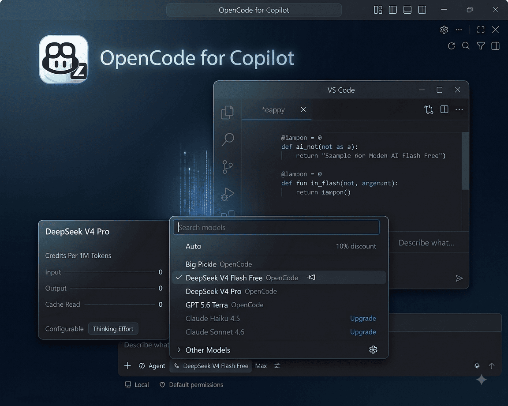
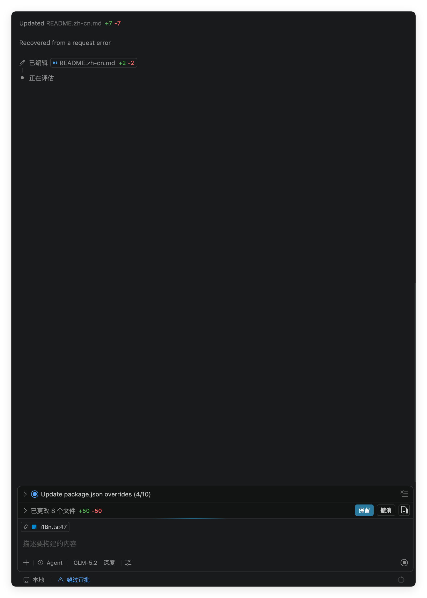

<h1 align="center">OpenRouter for Copilot Chat</h1>

<p align="center">
  
  <br/>
  
</p>

<p align="center">
  <a href="https://github.com/abbalochdev/openrouter-for-copilot/blob/main/README.md">English</a> |
  简体中文
</p>

**在 Copilot Chat 模型选择器中使用 OpenRouter 400+ 模型 — BYOK、视觉代理、推理模型与 `@swarm` 多 Agent 流水线。**

<p align="center">
  
</p>

## 快速开始

1. 在 [openrouter.ai/keys](https://openrouter.ai/keys) 创建 API Key
2. 运行 **OpenRouter: 设置 API Key**（存入系统密钥链）
3. 在 Copilot Chat 选择 OpenRouter 模型，或输入 `@swarm`

## 功能概览

- 注册 Copilot Chat 供应商 **`openrouter-for-copilot`**（显示名 OpenRouter），不新增聊天界面
- 从 OpenRouter 实时拉取模型目录（`GET /api/v1/models`）
- 请求走 `https://openrouter.ai/api/v1/chat/completions`（OpenAI 兼容）
- 保留 Copilot Agent 模式、工具、MCP、Instructions、Skills

<p align="center">
  
</p>

## 命令

| 命令 | 作用 |
| ---- | ---- |
| **OpenRouter: 设置 API Key** | 保存 Key |
| **OpenRouter: 清除 API Key** | 删除 Key |
| **OpenRouter: 打开 API Key 页面** | 打开 openrouter.ai/keys |
| **OpenRouter: 查询用量** | 打开 openrouter.ai/activity |
| **OpenRouter: 刷新模型列表** | 重新拉取目录 |
| **OpenRouter: 配置视觉代理** | 视觉源（自动 / VS Code LM / 自定义端点） |
| **OpenRouter: 设置 Ponytail 模式** | 编码纪律强度 |
| **OpenRouter: 切换代码精简器** | 开关 post-edit 精简 |
| **OpenRouter: 打开设置** | 跳转扩展设置 |
| **OpenRouter: 显示日志** | 输出通道 |
| **OpenRouter: 显示运行时诊断** | 运行时报告 |
| **OpenRouter: 打开请求 Dump 目录** | verbose 模式请求转储 |

## 功能特性

### Agent Swarm（`@swarm`）

并行研究 → 实现前评审 → 在**你当前选择的聊天模型**上实现。

未设置 `agentRoles` 时，每次运行前探测 OpenRouter `:free` 模型并按延迟排序，用于研究、评审与实现回退。可在设置中固定各角色模型。

### 视觉代理

自动模式先用 OpenRouter 的 `google/gemini-2.0-flash-001`，失败则回退到 VS Code 视觉模型。

<p align="center">
  
</p>

### 推理 / 思考

OpenRouter 目录中支持 `reasoning_effort` 的模型，可在 Copilot 模型菜单中调节推理强度。

### Ponytail 与代码精简器

- **Ponytail** — 懒人高级开发者系统指令（默认 `full`）
- **代码精简器** — 默认开启；与 Ponytail 同时启用时 Ponytail 降为 Lite

## 前置条件

- VS Code **1.116+**
- GitHub Copilot 订阅
- OpenRouter 账户与 API Key

## 安装

- Marketplace / Open VSX：`abbalochdev.openrouter-for-copilot`（发布后）
- 源码：`pnpm install && pnpm compile`

## 模型

Picker ID 为 OpenRouter slug（`provider/model`）。目录：[openrouter.ai/models](https://openrouter.ai/models)

| Slug | 说明 |
| ---- | ---- |
| `anthropic/claude-3.5-sonnet` | 通用编码 |
| `deepseek/deepseek-chat` | 快速经济；utility 别名默认目标 |
| `google/gemini-2.0-flash-001` | 多模态；默认视觉代理 |
| `meta-llama/llama-3.3-70b-instruct:free` | 免费层 |

## 设置项

命名空间 **`openrouter-for-copilot.*`**：

| 设置项 | 默认值 | 说明 |
| ------ | ------ | ---- |
| `baseUrl` | 留空 | 留空 → `https://openrouter.ai/api/v1` |
| `maxTokens` | `0` | 最大输出 token |
| `modelIdOverrides` | utility → `deepseek/deepseek-chat` | 映射 picker ID |
| `customModels` | `[]` | 额外模型 |
| `agentRoles` | `{}` | Swarm 角色模型 |
| `visionModel` | 留空 | VS Code 视觉回退 |
| `visionPrompt` | 内置 | 图片描述 prompt |
| `ponytailMode` | `full` | `off` / `lite` / `full` / `ultra` |
| `codeSimplifier` | `true` | 代码精简器 |
| `stripThinkTags` | `auto` | 剥离泄漏推理标签 |
| `rules` | `[]` | 用户规则 |
| `allowExtraTools` | `false` | Swarm 转发 MCP 工具（实验性） |
| `auditFreeModelProbeMs` | `6000` | 免费模型探针超时 |
| `debugMode` | `minimal` | 日志级别 |
| `experimental.stabilizeToolList` | `false` | 实验性工具列表稳定 |

修改 `customModels`、`modelIdOverrides` 或 `baseUrl` 后会自动刷新模型选择器，无需重启。

## 排错

### Agent 窗口看不到模型

```json
{
  "extensions.supportAgentsWindow": {
    "abbalochdev.openrouter-for-copilot": true
  }
}
```

### 402 余额不足

[openrouter.ai/activity](https://openrouter.ai/activity) 充值或改用 `:free` 模型。

### 404 模型不存在

运行 **OpenRouter: 刷新模型列表**。

## 从 OpenCode / GLM 迁移

一次性复制 `opencode-for-copilot.*` 设置与旧版密钥；OpenCode 模型 ID 与 endpoint 预设不兼容，需重新选择 OpenRouter slug。详见 [docs/porting-roadmap.md](docs/porting-roadmap.md)。

## 致谢

分支 lineage：[GLM for VS Code Copilot](https://github.com/umbrella22/glm-for-copilot) → [OpenCode for Copilot](https://github.com/abbalochdev/opencode-for-copilot) → OpenRouter for Copilot。MIT 许可证。

## 许可证

[MIT](LICENSE)
