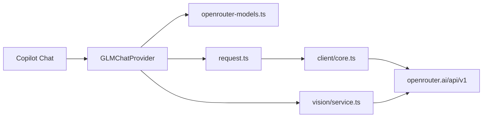

# Architecture — OpenRouter for Copilot

> Last updated: 2026-08-31 · vision native / proxy / mcp
>
> Folder map and request path: [code-structure.md](code-structure.md).

VS Code extension that registers **`openrouter-for-copilot`** as a Copilot Chat language-model provider. Chat traffic uses the **OpenAI-compatible** OpenRouter API (`POST /api/v1/chat/completions`). Model metadata comes from **`GET /api/v1/models`**.

---

## Request flow



| Module | Role |
| ------ | ---- |
| `src/provider/openrouter-models.ts` | Fetch/cache catalog; map slugs, pricing, context, capabilities |
| `src/config.ts` | Read `openrouter-for-copilot.*`; one-time legacy settings migration |
| `src/auth.ts` | API key in SecretStorage; legacy secret migration |
| `src/provider/index.ts` | `LanguageModelChatProvider` — models, token count, streaming |
| `src/provider/request.ts` | Build OpenAI-compatible payload; Ponytail, rules, tools |
| `src/client/core.ts` | HTTP streaming, retries, tool-halving, overflow retry |
| `src/provider/vision/` | Image routing: native bytes, proxy description, optional MCP store |
| `src/agents/*`, `src/runtime/agent-pipeline.ts` | `@swarm` pipeline |
| `src/provider/pricing/` | USD cost estimates in status bar |

---

## Model catalog

- **IDs:** OpenRouter slugs (`anthropic/claude-3.5-sonnet`, `deepseek/deepseek-chat`, …).
- **Cache TTL:** 5 minutes; failed fetch retries after 60 seconds.
- **Offline baseline** (before first fetch): four models in `openrouter-models.ts` fallbacks.
- **Custom models:** merged from `openrouter-for-copilot.customModels`.
- **Utility aliases:** `modelIdOverrides` defaults map `copilot-utility*` → `deepseek/deepseek-chat`.

`models-dev.ts` exists in the tree but is **not** used to enrich the OpenRouter catalog fetch.

---

## Vision

Image routing matches [GLM for Copilot](https://github.com/umbrella22/GLM-for-copilot). Default `visionMode` is `auto`:

1. **native** — catalog `imageInput` is true: resize (`_chat.resizeImage`) and send `image_url` under a 2.5 MiB binary budget (`vision/native.ts`). Native failures do not fall back to proxy.
2. **proxy** — otherwise describe with OpenRouter `google/gemini-2.0-flash-001`, then a VS Code/Copilot vision model. OCR-first prompt; description wrapped as untrusted image content. Proxy source is configured by **OpenRouter: Configure Vision Proxy** (`vision/ui/`).
3. **mcp** — optional global override: store files under globalStorage (`vision/image-store.ts`) and leave a local-path prompt. Requires an image-capable MCP tool (schema or `mcp.imageCapableTools`). If none is available, fall back to proxy when configured; otherwise error.

`openrouter-for-copilot.visionMode` of `native` / `proxy` / `mcp` forces that mode for every picker model. Custom slugs default to `imageInput: false`. See README **Attach images** for usage.

---

## Agent swarm (`@swarm`)

Participant ID: `openrouter-for-copilot.pipeline`.

When `agentRoles` is **unset**:

1. Probe all slugs in `FREE_MODEL_REFS` in parallel (`auditFreeModelProbeMs`, default 6000 ms).
2. Rank responders by latency.
3. Use that list for **research**, **review**, and **implementFallback**.
4. **Implement** always uses the model selected in Copilot Chat.

If the audit finds no alive models, fall back to `meta-llama/llama-3.3-70b-instruct:free`.

---

## Resilience (active in OpenRouter path)

| Mechanism | Location |
| --------- | -------- |
| HTTP retry + backoff | `client/core.ts` |
| Tool-halving on overload | `client/core.ts` |
| Context overflow retry | `client/error/overflow-retry.ts` |
| Swarm sub-agent retry | `agents/retry.ts` |
| Swarm model failover | `agents/loop.ts`, `agents/implement.ts` |
| Request dedup (utility kinds) | `provider/index.ts` |
| Vision description cache | `provider/vision/resolve.ts` (proxy mode) |

Anthropic wire-protocol code remains in `src/client/anthropic/` for custom `baseUrl` overrides, but **OpenRouter defaults always use the OpenAI protocol** (`getApiProtocol()` → `'openai'`).

---

## Configuration refresh

Changing these settings triggers catalog refresh and client cache clear:

- `customModels`
- `modelIdOverrides`
- `baseUrl`
- `apiKey` (settings fallback only; primary key is SecretStorage)

API key changes via SecretStorage refresh the model picker across windows.

---

## Legacy compatibility

| Item | Behavior |
| ---- | -------- |
| `opencode-for-copilot.*` settings | One-time copy into `openrouter-for-copilot.*` (see [porting-roadmap.md](porting-roadmap.md)) |
| `glm-copilot.apiKey*` secrets | One-time copy into `openrouter-for-copilot.apiKey` |
| Manual `baseUrl` → `opencode.ai` | Error-message mapping only |
| Manual `baseUrl` → BigModel / Z.ai | CNY pricing hint + GLM error codes |
| `GLMChatProvider` class name | Legacy identifier; implements OpenRouter provider |

---

## Development

```bash
pnpm install
pnpm compile
pnpm test
pnpm package    # → dist/openrouter-for-copilot-*.vsix
pnpm install:vsix   # package + install locally (suppresses VS Code CLI DEP0169 noise)
```

To install an existing VSIX without the Node 24 `url.parse` deprecation warning from the **VS Code CLI** (not this extension):

```powershell
$env:NODE_OPTIONS="--disable-warning=DEP0169"
code --install-extension "dist\openrouter-for-copilot-3.11.14.vsix"
```

Or use `pnpm install:vsix`, which sets that automatically.

Extension ID: **`wylasdasd.openrouter-for-copilot`**.
